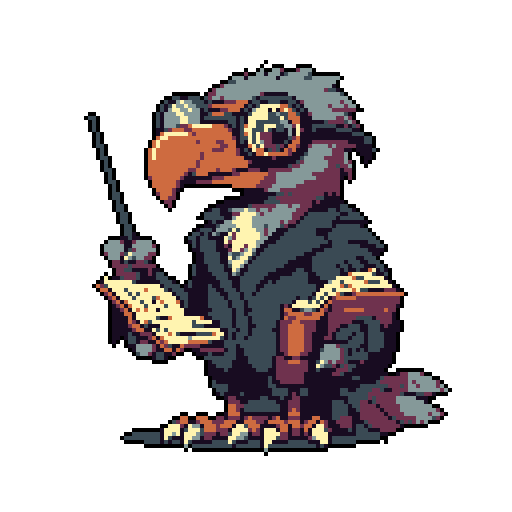
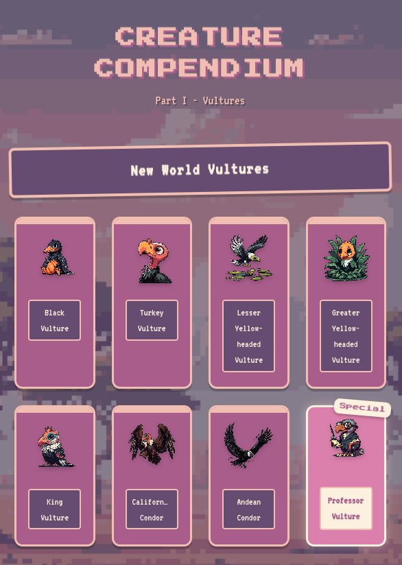

# Vultur Encyclopedia

**Educational vulture encyclopedia with pixelated retro style**

────

**New World Vultures** • **Old World Vultures** • **Professor Vulture Facts**

────

## Discover Amazing Vultures

*Interactive vulture cards with detailed information*

*Special facts from Professor Vulture*

*Beautiful pixel art illustrations*

────

## Features

## How It Works

Explore vultures through an interactive grid. Click on any vulture to see detailed information or learn fascinating facts from Professor Vulture. Enjoy the pixel art aesthetic with a modern feel.

## Vulture Species

**MIT License © 2023 bxavaby**

